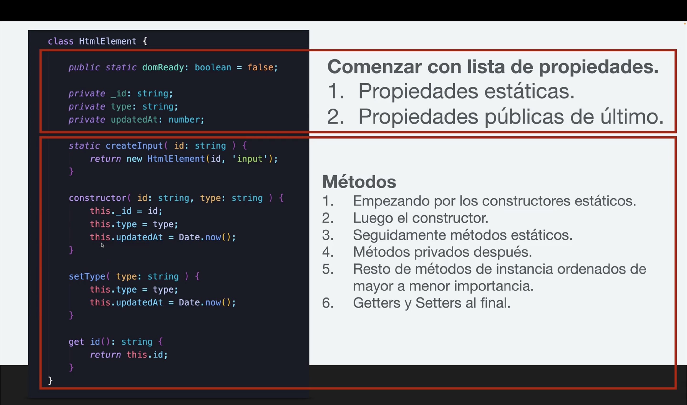
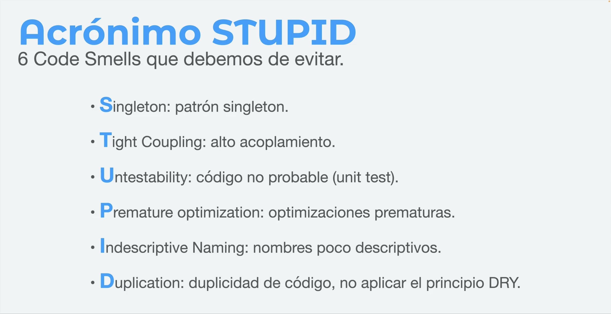
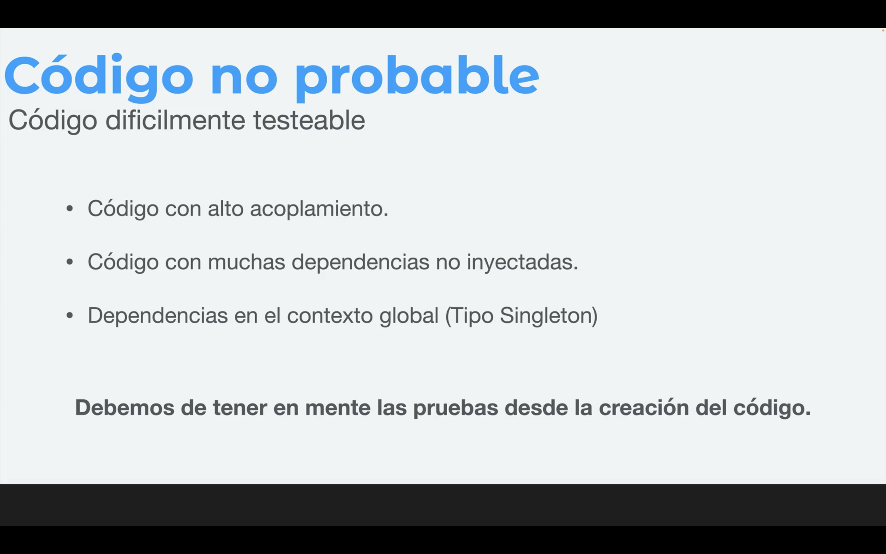

# Clean Code - SOLID

## Proyecto para practicar

Este es un proyecto de Vanilla TypeScript en Vite, para trabajar los ejercicios del curso sobre Principios SOLID y CleanCode.

Clonar o descargar el proyecto y luego:

```
yarn install
ó
npm install
```

Para ejecutar el proyecto, simplemente ejecuten:

```
yarn dev
ó
npm run dev
```

## Conceptos Claves

- Deuda técnica.
- Clean Code.
- Los nombres de las clases preferiblemente deben ser cortos y no genéricos.
- En una función limitar los parámetros posicionales a 3 como máximo.
- Evitar redundancias, por ejemplo si una función se llama *getMovieById* no es necesario que el parámetro sea *movieId*, podría llamarse sólo *id*.
- Organizar las propiedas de una clase o interface en orden alfabético (ascendente).
- Las funciones sólo deben hacer un único trabajo o tarea conforme al nombre especificado.
- Principio KISS.
- Balance entre simplicidad y legibilidad para las funciones.
- Producrar que cada función no sobrepase las 20 líneas.
- Evitar el uso de else.
- Priorizar el uso de la condicional ternaria en lo posible.
- Menos indentación es mejor.
- Principio DRY (Don't Repeat Yourself).
- Principio de responsabilidad única.
- Las propiedades se organizan en el siguiente orden: 1. statics 2. publics 3. privates
- Estructura Recomendada de Clases:


Fuente de la imagen: devtalles.com

- Recomendación para los comentarios:


Fuente de la imagen: devtalles.com

- Uniformidad en el proyecto. Problemas similares, soluciones similares.
- STUPID+ (code smell)


Fuente de la imagen: devtalles.com

- Alta cohesión y bajo acoplamiento es lo ideal para las clases y módulos.
- Es preferible la composición de clases que la herencia.
- Son peferibles los parámetros referenciados que los parámetros posicionales cuando son más de 3 para una función, método o procedimiento.

- Código no probable.


Fuente de la imagen: devtalles.com

- Nombres de clases o módulos muy genéricos, al igual que otros elementos como las funciones por ejemplo, conlleva a que este haga demasiadas cosas.
- Procurar funciones o métodos de máximo 10 líneas.
- Sí una clase o función/método es muy extensa o se observa en ella muchas tareas (sombreros) contenidas, es mejor dividir en varias clases o funciones, de forma tal, que cada una realice una sóla tarea. Es decir, evitar la inflación.
- Evitar la obsesión primitiva.
- Acopladores: 
    - Feature envy (una clase depende de las propiedades de otra).
    - Intimidad inapropiada (una o varias clases son dependendientes de los métodos de otra).
    - Cadenas de mensajes (navegación o comunicación entre clases, módulos, funciones o métodos de forma no directa ej: a -> b -> c => a = c. Es decir, consiste en un canal de comunicación inflado).
    - The middle man (cuando una clase delega su responsabilidad a otra).
- Los 5 principios S.O.L.I.D. de diseño de software son:

    S – Single Responsibility Principle (SRP)

    O – Open/Closed Principle (OCP)

    L – Liskov Substitution Principle (LSP)

    I – Interface Segregation Principle (ISP)

    D – Dependency Inversion Principle (DIP)


